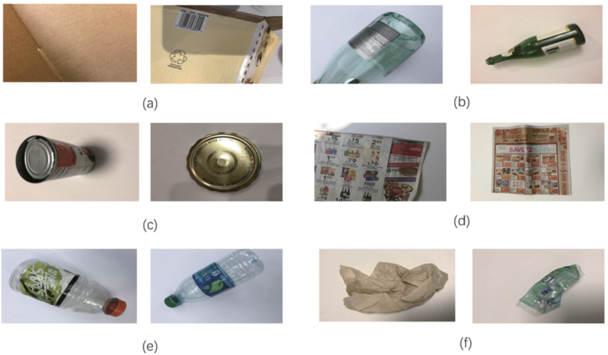
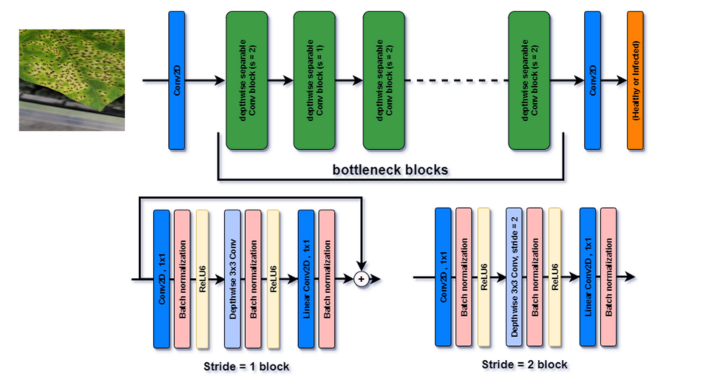
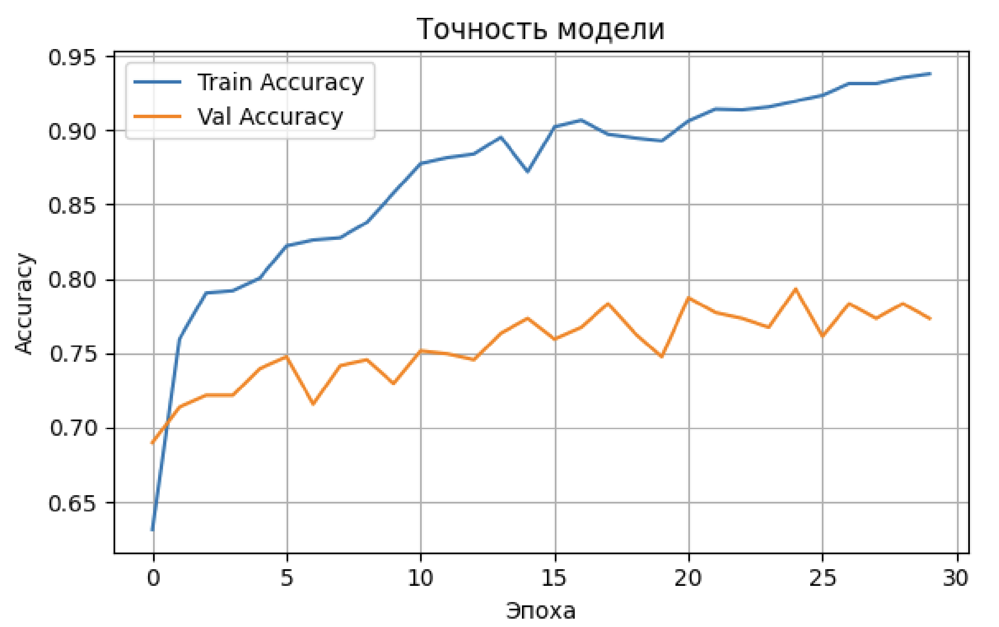
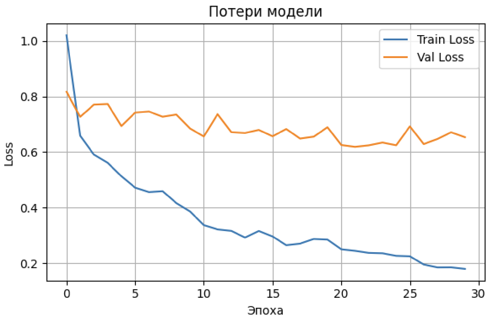
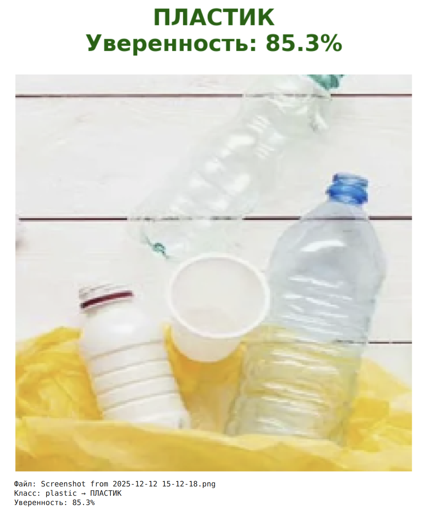

# Проект EcoWasteClassifier

Добро пожаловать в проект EcoWasteClassifier! Это сквозное решение на основе машинного обучения для классификации отходов по категориям переработки. Создано в рамках экологического проекта, оно демонстрирует transfer learning с использованием TensorFlow и Keras для эффективной сортировки изображений мусора.


## Технический стек

<p align="left">
  <a href="https://www.python.org"></a>
  <a href="https://www.tensorflow.org"></a>
  <a href="https://keras.io"></a>
  <a href="https://numpy.org"></a>
  <a href="https://matplotlib.org"></a>
  <a href="https://colab.research.google.com"></a>
</p>

## Структура проекта
- `README.md`: Этот файл — ваш гид по всему.
- `MIPHI_project_practice_Liuboshenko_v2.ipynb`: Полный ноутбук для обучения.
- `inference.ipynb`: Специальный ноутбук для загрузки и тестирования предобученной модели на новых изображениях.
- `EcoWasteClassifier.h5`: Файл предобученной модели (компактный размер, ~17 МБ).
- `requirements.txt`: Список зависимостей для простой установки.
- `TODO.md`: Планируемые улучшения и будущая работа.
- `examples/`: Папка с несколькими примерами изображений для тестирования (например, cardboard.jpg, glass.jpg — добавьте плейсхолдеры или опишите, как добавить их).

## Решаемая проблема
В современном мире неправильная утилизация отходов значительно способствует загрязнению окружающей среды, переполнению свалок и потере ресурсов. Уровень переработки остается низким частично из-за путаницы в сортировке материалов, таких как картон, стекло, металл, бумага, пластик и обычный мусор. Этот проект решает эту проблему, создавая AI-классификатор изображений, который автоматически определяет типы отходов по фото. Используя реальный датасет (TrashNet), мы обучили модель распознавать эти 6 классов, что позволяет создавать умные приложения для переработки, интеллектуальные контейнеры или образовательные инструменты. Результат? Легковесная, точная модель, работающая на стандартном оборудовании, с точностью валидации около 85-90% (на основе типичных запусков с transfer learning на MobileNetV2). Это способствует устойчивым практикам, делая сортировку отходов доступной и безошибочной.


## Что мы достигли
- **Датасет**: TrashNet (2527 изображений по 6 классам: cardboard, glass, metal, paper, plastic, trash).



- **Архитектура модели**: Transfer learning на базе MobileNetV2 (предобученной на ImageNet), с добавлением кастомных плотных слоев для классификации.



- **Обучение**: Аугментация данных, ранняя остановка и снижение скорости обучения для надежной производительности. Обучение на GPU для эффективности.





- **Выход**: Сохраненная модель `EcoWasteClassifier.h5`, готовая к развертыванию. Она предсказывает с оценкой уверенности и визуализирует результаты.
- **Удобство использования**: Простые в запуске ноутбуки для обучения и инференса, плюс графики для анализа производительности.
### **Пример работы модели в инференсе**:



Это не просто демо — это практический инструмент, который можно интегрировать в мобильные приложения или IoT-устройства для сортировки отходов в реальном времени.


## Инструкции по установке и использованию

### Шаг 1: Клонирование репозитория
Сначала загрузите код на свой локальный компьютер:
```
git clone https://github.com/Liuboshenko/EcoWasteClassifier_MIPHI_project_practice.git
cd EcoWasteClassifier_MIPHI_project_practice.git
```

### Шаг 2: Создание виртуального окружения
Чтобы изолировать зависимости, настройте виртуальное окружение Python3.12:
```
python -m venv env3.12
source env/bin/activate  
```

### Шаг 3: Установка зависимостей
Установите все необходимые пакеты из предоставленного файла:
```
pip install -r requirements.txt
```
Это включает TensorFlow, Keras, Matplotlib, NumPy и другие essentials

### Шаг 4: Обучение модели (опционально)
Если хотите переобучить с нуля:
1. Откройте `MIPHI_project_practice_Liuboshenko_v2.ipynb` в Jupyter Notebook или Google Colab.
2. Запускайте ячейки последовательно (как описано в комментариях ноутбука).
3. Модель скачает датасет, обучит, построит графики и сохранит как `EcoWasteClassifier.h5`.
4. Файл модели автоматически скачается для удобства.

Примечание: В Colab используйте GPU-runtime для ускорения обучения (Runtime > Change runtime type).

### Шаг 5: Использование предобученной модели локально
Для тестирования модели на своих изображениях:
1. Откройте `inference.ipynb` в Jupyter Notebook.
2. Запустите ячейки для загрузки модели.
3. Используйте функцию `predict_waste()`:
   - Вызовите `predict_waste()` для интерактивной загрузки изображения (перетащите в Jupyter).
   - Или передайте путь к файлу: `predict_waste('path/to/your/image.jpg')`.
4. Отобразится изображение с предсказанным классом (на русском в эко-тематике: КАРТОН, СТЕКЛО и т.д.) и оценкой уверенности, с цветовой кодировкой (зеленый >80%, оранжевый 50-80%, красный <50%).

Пример вывода: График с изображением и заголовком вроде "ПЛАСТИК\nУверенность: 92.5%".

### Запуск в Google Colab
- Загрузите файлы репозитория в Colab.
- Установите зависимости с помощью `!pip install -r requirements.txt`.
- Загрузите модель из `EcoWasteClassifier.h5` и тестируйте.

## Пример использования
После настройки, в `inference.ipynb`:
```python
predict_waste('examples/cardboard.jpg')
```
Или интерактивно:
```python
predict_waste()  # Запросит загрузку
```

## Вклад в проект
Проверьте `TODO.md` для идей.

## Лицензия
MIT License — свободно используйте, модифицируйте и распространяйте.
